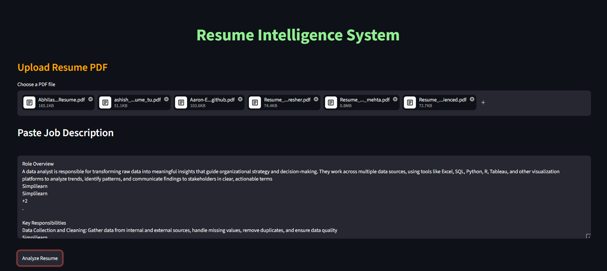
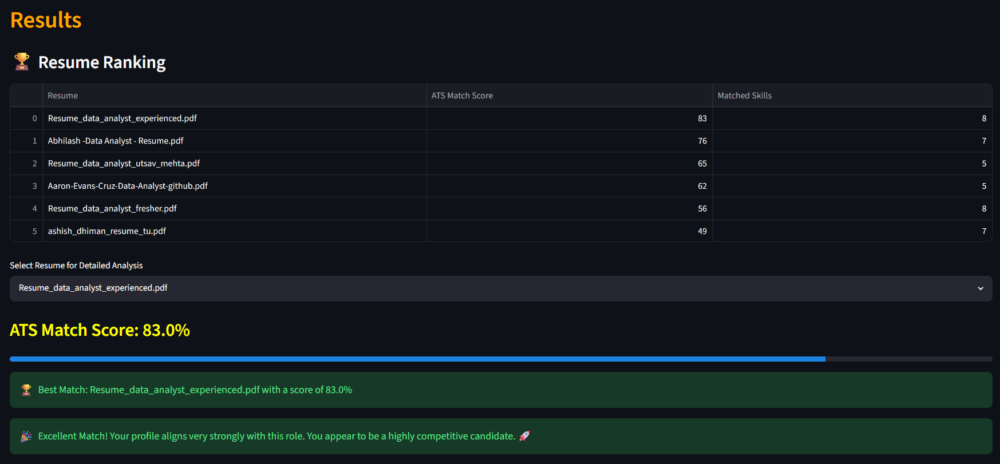

# Resume Intelligence System — V1




An ATS (Applicant Tracking System) simulator that analyzes resumes against a job description, scores candidates, and ranks them — built with Python, Streamlit, and NLP techniques.

---

## Table of Contents

- [Overview](#overview)
- [Features](#features)
- [Project Structure](#project-structure)
- [How It Works](#how-it-works)
- [Installation](#installation)
- [Usage](#usage)
- [Scoring Logic](#scoring-logic)
- [Known Limitations](#known-limitations)
- [Tech Stack](#tech-stack)
- [Future Improvements (V2)](#future-improvements-v2)

---

## Overview

Most companies use ATS software to filter resumes before a human ever reads them. This project simulates that process — upload one or multiple resumes as PDFs, paste a job description, and the system scores each resume on skill match and experience fit, then ranks candidates automatically.

Built as a practical NLP pipeline project demonstrating text extraction, preprocessing, rule-based entity recognition, and scoring logic on real-world unstructured data.

---

## Features

- Upload multiple PDF resumes simultaneously
- Paste any job description for analysis
- Extracts skills from both resume and JD using a curated skill dictionary
- Extracts work experience using section-aware regex parsing
- Computes a composite ATS Match Score (skill + experience weighted)
- Ranks all uploaded resumes by score in a sortable table
- Per-resume breakdown: matched skills, missing skills, experience detected
- Identifies the best candidate automatically

---

## Project Structure

```
resume-intelligence-v1/
│
├── app.py          # Streamlit UI — upload, display, interaction logic
├── utils.py        # Core NLP pipeline — extraction, scoring, matching
├── skills.py       # Curated skill dictionary (SKILLS list)
└── README.md
```

### File responsibilities

**`app.py`**
- Streamlit page config, layout, and UI components
- Orchestrates the analysis flow on button click
- Stores results in `st.session_state` so the UI doesn't re-run analysis on every widget interaction
- Displays ranking table, per-resume detail, progress bar, and eligibility message

**`utils.py`**
- `extract_resume_text()` — reads PDF pages with pdfplumber
- `preprocess_text()` — lowercases, removes punctuation, normalises whitespace
- `extract_skills()` — regex word-boundary matching against SKILLS dictionary
- `find_missing_skills()` — set difference between JD skills and resume skills
- `skill_match_score()` — percentage of JD skills found in resume
- `calculate_match_score()` — TF-IDF cosine similarity between skill lists
- `extract_experience()` — section-aware date-range parser (see below)
- `experience_score()` — maps extracted experience to 0–100 score vs JD requirement
- `generate_suggestions()` — rule-based improvement tips for missing skills

**`skills.py`**
- A flat list of skill keywords (`SKILLS`) used for matching
- Covers programming languages, tools, frameworks, cloud platforms, and soft skills

---

## How It Works

### 1. Text Extraction
`pdfplumber` opens each uploaded PDF and extracts raw text page by page. This handles standard digitally-authored PDFs well. Scanned/image PDFs are not supported in V1.

### 2. Preprocessing
Text is lowercased, punctuation is stripped, and whitespace is normalised to a single space. This ensures "Python," and "python" both match.

### 3. Skill Extraction
The preprocessed text is scanned against every entry in `SKILLS` using `re.search` with word boundaries (`\b`). This prevents partial matches (e.g. "R" matching inside "Regression"). Skills found in both the resume and JD are intersected to compute the match.

### 4. Experience Extraction
This is the most complex component. A naive `\d+ years` regex fails on real resumes because project descriptions contain phrases like *"data spanning 5 years"* which are not work experience. V1 solves this with a multi-strategy parser:

**Priority order:**
1. **Fresher keywords** — if "fresher", "entry-level", or "no experience required" appears → returns `(0.0, 0.0)` immediately
2. **Summary headline** — searches only the first 500 characters for `"X years of experience"` phrasing (catches experienced candidates' summary lines)
3. **Date-range computation** — scans line by line, tracks the current section (Work Experience, Business Experience, Academic Project, Education, etc.), and sums only job employment date ranges — skipping education and project sections
4. **JD-style patterns** — handles `2-4 years`, `5+ years`, `minimum 3 years` for job description parsing
5. **Contextual fallback** — matches `X years` only if NOT preceded by phrases like *"over a period of"*, *"past"*, *"last"*, *"nearly"* etc.

**Section detection** uses two regex patterns:
- `WORK_SECTION_RE` — matches headers like `Work Experience`, `Professional Experience`, `Business Experience`, `Employment`
- `NON_WORK_RE` — matches headers like `Education`, `Academic Project`, `Certification`, `Skills`, `Internship`

Dates on the same line as company names (inline format) are also handled by checking the next 2–3 lines for role/company keywords.

### 5. Scoring

See [Scoring Logic](#scoring-logic) below.

### 6. Ranking
All resumes are collected into a pandas DataFrame, sorted descending by ATS Match Score, and displayed in the UI. The user can then select any resume from a dropdown for detailed analysis.

---

## Installation

### Prerequisites
- Python 3.8+
- pip

### Steps

```bash
# 1. Clone the repository
git clone https://github.com/YashwanthNarra/resume_matcher.git
cd resume_matcher

# 2. Create a virtual environment (recommended)
python -m venv venv
source venv/bin/activate        # On Windows: venv\Scripts\activate

# 3. Install dependencies
pip install -r requirements.txt

# 4. Run the app
streamlit run app.py
```

### requirements.txt

```
streamlit
pdfplumber
scikit-learn
pandas
```

---

## Usage

1. Open the app in your browser (Streamlit will print the local URL, usually `http://localhost:8501`)
2. Click **"Browse files"** under *Upload Resume PDF* — select one or more PDF resumes
3. Paste the job description text into the text area
4. Click **"Analyze Resume"**
5. View the ranking table — resumes sorted by ATS Match Score
6. Select any resume from the dropdown for a detailed breakdown:
   - ATS Match Score with progress bar
   - Eligibility message (Excellent / Good / Needs Improvement)
   - Matched skills list
   - Missing skills list
   - All skills detected in the resume
   - All skills detected in the JD

---

## Scoring Logic

The final **ATS Match Score** is a weighted composite:

```
ATS Match Score = (Skill Match Score × 0.7) + (Experience Score × 0.3)
```

### Skill Match Score (70% weight)
```
Skill Match Score = (matched skills / total JD skills) × 100
```
A candidate who matches 7 out of 10 JD skills scores 70.

### Experience Score (30% weight)
The JD's experience requirement is parsed the same way as a resume. Scoring rules:

| Situation | Score |
|---|---|
| JD requires 0 years (fresher role) | 100 |
| Candidate has 0 years, JD needs experience | 0 |
| JD says `X+` years, candidate meets it | 100 |
| JD says `X+` years, candidate is short | `(candidate_years / X) × 100` |
| JD gives range, candidate is within it | 100 |
| Candidate is below range minimum | `(candidate_years / min) × 100` |
| Candidate is overqualified | `max(70, 100 - (excess years × 5))` |

### Example
JD requires 2–4 years. Candidate has 3 years and matches 8/10 skills:
```
Skill Score    = (8/10) × 100 = 80
Experience Score = 100 (within range)
ATS Score      = (80 × 0.7) + (100 × 0.3) = 56 + 30 = 86
```

---

## Known Limitations

| Limitation | Impact |
|---|---|
| Scanned / image PDFs | Text extraction returns empty — score will be 0 |
| Two-column resume layouts | pdfplumber may extract columns out of order, breaking section detection |
| Unusual section headers (e.g. "Track Record", "Consulting History") | Dates in those sections may not be counted as work experience |
| Overlapping jobs (two jobs simultaneously) | Months are summed, so experience may be double-counted |
| Date formats like `08/2019` or `Q1 2020` | Not supported in V1 — only `Month YYYY` and `YYYY` formats |
| Skill dictionary coverage | Skills not in `skills.py` will never be matched, regardless of how prominently they appear |
| No semantic understanding | "Proficient in snake language" will not match "Python" — matching is purely keyword-based |

---

## Tech Stack

| Tool | Purpose |
|---|---|
| Python 3.8+ | Core language |
| Streamlit | Web UI and file upload |
| pdfplumber | PDF text extraction |
| scikit-learn | TF-IDF vectorization and cosine similarity |
| pandas | Results aggregation and ranking |
| re (stdlib) | All text parsing and pattern matching |

---

## Future Improvements (V2)

V2 will upgrade this from a rule-based pipeline to a genuine ML system:

- **Sentence Transformers (HuggingFace)** — replace keyword matching with semantic similarity using `all-MiniLM-L6-v2`. A resume saying "experience with relational databases" will correctly match a JD asking for "SQL".
- **MLflow experiment tracking** — log every analysis run (scores, matched skills, resume name) as an MLflow experiment for observability and comparison
- **Docker + docker-compose** — containerise the full app for one-command reproducible deployment
- **MM/YYYY date format support** — extend experience extraction to handle `08/2019 – 05/2022` style dates
- **Overlap-aware experience calculation** — deduplicate overlapping job date ranges before summing
- **Named Entity Recognition** — use spaCy NER to extract candidate name, email, and education degree automatically
- **OCR support** — integrate pytesseract for scanned PDF resumes